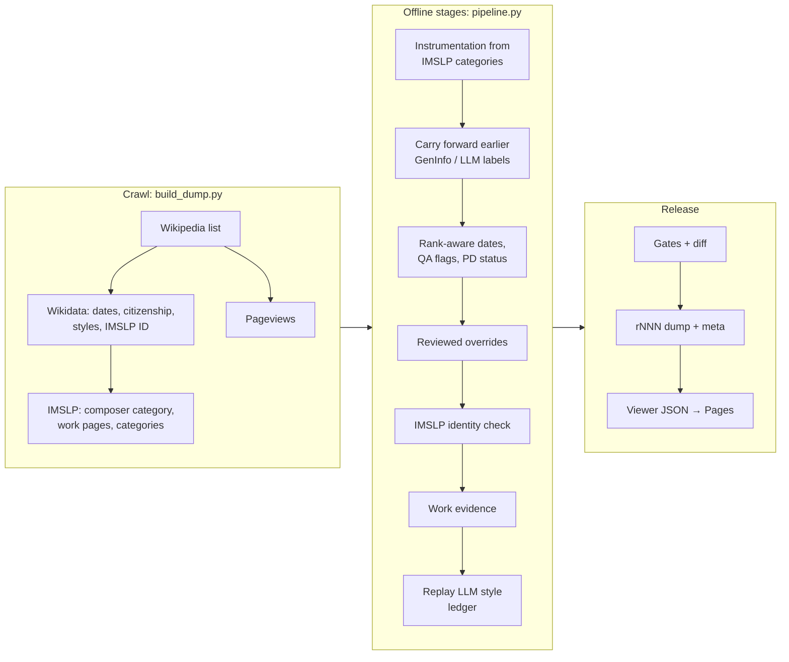

# eu-pd-composers

A versioned dataset and a static browser for finding 20th-century classical composers whose music is likely public domain in the EU (life + 70 years), with links to their works on IMSLP.

**Live viewer:** [egorpol.github.io/eu-pd-composers](https://egorpol.github.io/eu-pd-composers/) · **Release:** v3.5.0 · **Dump:** r015 (schema 3) · [Changelog](CHANGELOG.md) · [Versioning](VERSIONING.md)

> **Not legal advice.** "Public domain" here is a heuristic based on the composer's death year only. It ignores lyricists and librettists, editions, arrangements, posthumous publication rights and national exceptions. Check the work itself before you copy, perform or publish it.

## What is in the current dump (r015)

| | |
|---|---|
| Composers | **3,369** from the English Wikipedia *List of 20th-century classical composers*, with Wikidata life dates (rank-aware, with precision), citizenship, occupations and styles, plus 12 months of Wikipedia pageviews |
| EU public-domain status (reference year 2026) | **778** PD now (died 1955 or earlier) · **1,869** not yet · **722** with no death date on record. 21 more enter the public domain on 1 January 2027, 82 more by 2031 |
| IMSLP identity | **1,254** composers matched to an IMSLP category: 974 through Wikidata's IMSLP ID, 280 by name, confirmed against IMSLP's own life dates or Wikipedia link. 14 wrong matches rejected; 7 name matches IMSLP cannot confirm; 2,094 not found |
| Works | **29,026** IMSLP work pages for 1,058 composers. **20,389** belong to the 657 PD-now composers who have works on IMSLP |
| Instrumentation (`force_family`) | 17 families (piano solo, solo voice, choral, orchestral, chamber, …) plus `unclassified` / `other`. 98.2% come straight from IMSLP's categories, 1.3% from earlier LLM guesses |
| Work-level IMSLP evidence | IMSLP period style (99.8% of works), first publication year (73.9%), IMSLP's own copyright flags (22.3%), librettists (27.3%) |
| Composer styles | Wikidata movements for 153 composers; agreed labels from two LLMs, grounded in the Wikipedia lead, for 2,842 |

Every label carries its source (`*_src` columns, `qa_flags`, `imslp_match_evidence`, per-model LLM votes), and every revision is immutable with a `dump_meta_rNNN.json` that records how it was built. Only the latest revision lives in `data/`; older ones are in git history.

A useful cross-check: IMSLP flags 4,522 of the 7,829 works by not-yet-PD composers as not PD in the EU, but only 65 of the 20,389 works by PD-now composers. Those 65 are mostly vocal works and posthumous publications, which a composer-only rule cannot see.

## Use cases

**Find playable public-domain repertoire.** Performers, teachers, ensembles and editors: open the [viewer](https://egorpol.github.io/eu-pd-composers/), keep *EU public domain = PD now*, then filter by instrumentation, style, citizenship or popularity. Open a work on IMSLP and check its scores, copyright notes and librettist.

**Plan around upcoming public-domain dates.** Publishers, archives and festivals: the EU public-domain filter also offers *enters next 1 January*, *in 2–5 years* and *later*; the dump column `eu_pd_year` gives the year.

**Use the data in research.** Load the TSVs (pipe-joined lists, empty string for missing):

```python
import pandas as pd
composers = pd.read_csv("data/composers_r015.tsv", sep="\t", dtype=str, keep_default_na=False)
works = pd.read_csv("data/works_r015.tsv", sep="\t", dtype=str, keep_default_na=False)
```

Cite the revision id (`r015`) and the release tag. Column reference and caveats: [`data/README.md`](data/README.md).

**Maintain the dataset.** These are the jobs a maintainer runs (details in [`docs/PIPELINE.md`](docs/PIPELINE.md) and [`docs/AUTOMATION.md`](docs/AUTOMATION.md)):

| Task | How | Network |
|---|---|---|
| Rebuild from current Wikipedia, Wikidata and IMSLP | Run the **refresh** workflow in GitHub Actions, or `python scripts/pipeline.py refresh --base r015`. It opens a PR with a readable diff | Yes, about 2–2.5 h (IMSLP at ≤ 1 request/s) |
| Fix a wrong person, date or IMSLP match | Add a sourced row to [`data/overrides/composers.tsv`](data/overrides/README.md), then derive. A re-key to a new Wikidata item first needs `python scripts/refetch_override_entities.py` | Only for new re-key targets |
| Change a rule (instrumentation mapping, identity check, PD arithmetic) | Edit the code, then `python scripts/pipeline.py derive --from-dump r015 --to r016` | No |
| Relabel composer styles with LLMs | `scripts/llm_style_pass.py` appends to the committed ledger in `data/llm_ledger/` (a local step that needs approval); `derive` replays it. The pipeline never calls a model | Model CLIs only |
| Review a revision | `python scripts/diff_dumps.py r015 r016 --out diff.md` and `python scripts/check_release.py --dump r016 --against r015` | No |
| Preview the viewer | `python scripts/export_viewer_json.py --dump r015`, then `python -m http.server 8080 --directory viewer` | No |
| Publish | Merge to `main`: CI runs the tests and release gates; Pages redeploys `viewer/` | — |

## How it works



1. **Crawl** (network): the Wikipedia list gives names; Wikidata gives identity and dates; IMSLP gives each composer's work pages and every page's complete category list. All responses are cached in `data/cache/` (gitignored).
2. **Offline stages** (no model calls): each stage reads one revision and writes the next, so a single rule change re-derives everything downstream. Wrong-person IMSLP matches are rejected by comparing life dates; hand-reviewed overrides are applied before the identity check.
3. **Release**: gates fail the build on large unexplained changes (composers ±3%, works −5%, lost columns, inconsistent labels), and a diff report lists PD flips, identity changes and label transitions for review.

## What it does not do (yet)

- **Public domain beyond the composer.** No lyricist, translator or arranger terms, no edition or posthumous-publication rights, no wartime extensions, no US status. IMSLP's own copyright flags are carried as evidence only.
- **Score availability.** Works are IMSLP *work pages*; whether a page has a downloadable score is not checked (`has_files` is empty), and 199 matched composers have no works listed.
- **Measured accuracy.** There is no gold set yet, so no error rates. LLM style labels are only compared for agreement with Wikidata and IMSLP, which are not ground truth either.
- **Coverage beyond one list.** The cohort is one English Wikipedia list and inherits its selection biases. About 62% of composers have no IMSLP category, many because their music is still in copyright.
- **Scheduled refreshes.** The monthly schedule is ready but stays off until IMSLP has acknowledged the crawl.

## Repository layout

```text
data/
  composers_r015.tsv, works_r015.tsv, dump_meta_r015.json   # the product (latest revision only)
  overrides/composers.tsv     # hand-reviewed, sourced fixes
  llm_ledger/                 # append-only LLM style decisions (replayed offline)
viewer/                       # static filter UI, published by GitHub Pages
scripts/
  pipeline.py                 # refresh (crawl + all stages) / derive (offline stages)
  build_dump.py               # crawl: Wikipedia → Wikidata → pageviews → IMSLP
  remap_force.py, carry_forward.py, remap_composers.py, apply_overrides.py,
  remap_imslp_matches.py, remap_work_evidence.py, apply_llm_styles.py   # offline stages, in order
  refetch_*.py                # cache fillers (network, resumable)
  check_release.py, diff_dumps.py, export_viewer_json.py               # gates, review, viewer
  llm_style_pass.py, fetch_wikipedia_leads.py, style_agreement.py, pilot_sample.py   # LLM style study
  common.py, imslp.py, wikidata_enrich.py, force_family.py, …          # shared modules
  legacy/                     # one-off passes that produced older labels; not run by the pipeline
tests/                        # offline pytest suite (no network)
docs/PIPELINE.md, docs/AUTOMATION.md
```

## Setup

```bash
pip install -r requirements.txt        # requirements-dev.txt adds pytest
python -m pytest tests -q
```

## License

Code: MIT (see `LICENSE`). Data drawn from Wikipedia, Wikidata and IMSLP remains under their respective terms.
