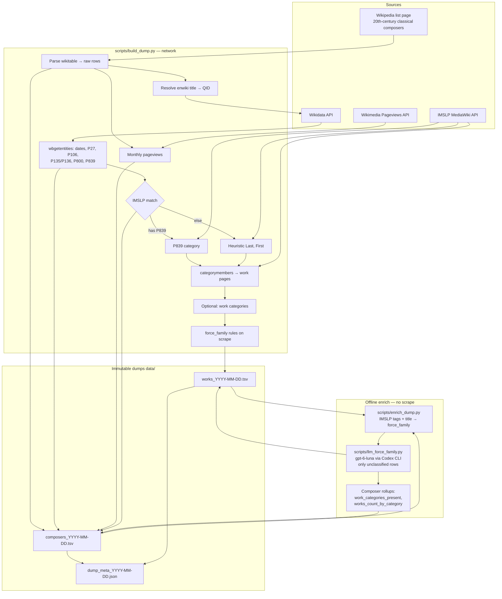
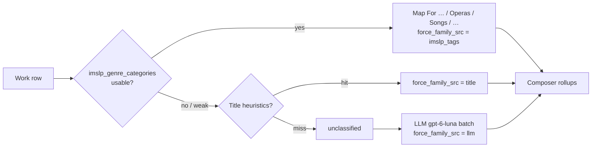

# Pipeline overview

How `eu-pd-composers` builds composer + works dumps. Heuristic PD only — not legal advice.

## End-to-end flow



## force_family decision order



## Match statuses (IMSLP)

| `imslp_match_status` | Meaning |
|---|---|
| `matched` | Wikidata P839 category verified on IMSLP |
| `unverified_heuristic` | `Last,_First` category exists (collision risk) |
| `not_found` | No category resolved |
| `not_checked` | `--no-imslp` |

## Typical commands

```bash
# Full scrape (long; heartbeats every 30s)
python scripts/build_dump.py --date YYYY-MM-DD

# Rules + title force_family (offline)
python scripts/enrich_dump.py --from-dump 2026-09-26 --date YYYY-MM-DD

# LLM fill for remaining unclassified (Codex + gpt-6-luna)
python scripts/llm_force_family.py --from-dump 2026-09-27 --date YYYY-MM-DD
python scripts/llm_force_family.py --from-dump 2026-09-27 --limit 80 --date YYYY-MM-DD  # pilot
```

Caches: `data/cache/` (gitignored). LLM batches resume from `data/cache/llm_force_family/`.
