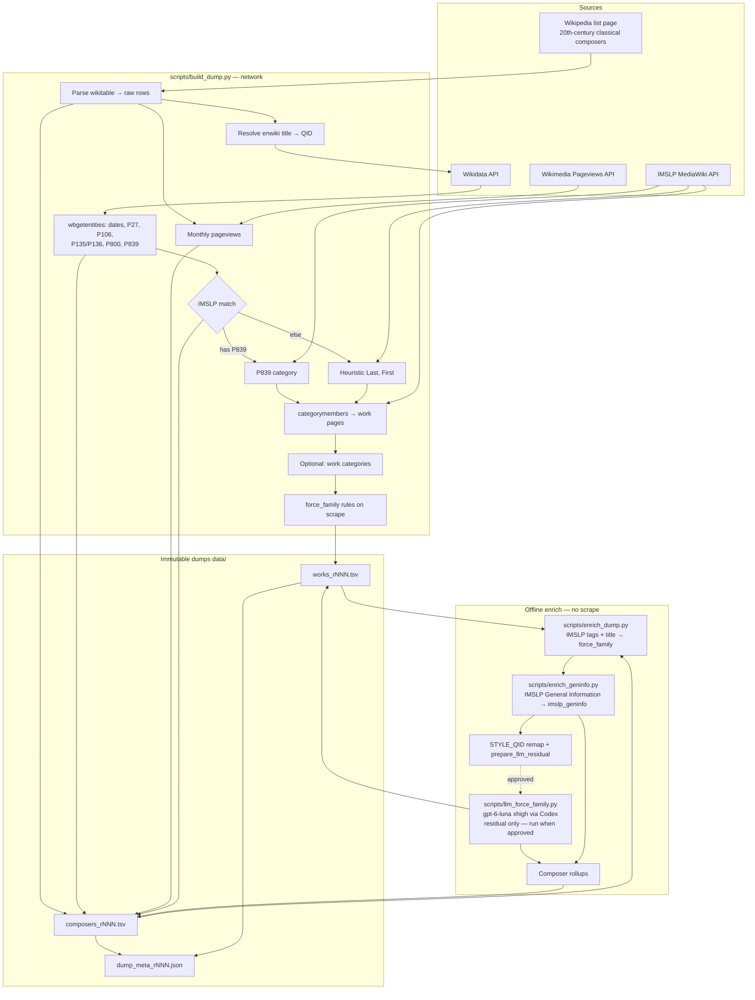
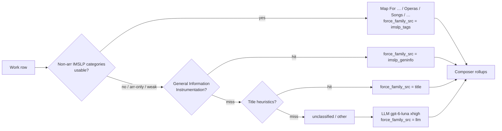

# Pipeline overview

How `eu-pd-composers` builds composer + works dumps. Heuristic PD only — not legal advice.

## End-to-end flow



## force_family decision order



Arrangement `(arr)` category tokens never set force; opera/voice beat concerto; original orchestra beats piano reductions.

## Match statuses (IMSLP)

| `imslp_match_status` | Meaning |
|---|---|
| `matched` | Wikidata P839 category verified on IMSLP |
| `unverified_heuristic` | `Last,_First` category exists (collision risk) |
| `not_found` | No category resolved |
| `not_checked` | `--no-imslp` |

## Typical commands

```bash
# Full scrape (long; heartbeats every 30s) — calendar id OK for raw scrapes
python scripts/build_dump.py --date YYYY-MM-DD

# Promote into revision series
python scripts/promote_revision.py --from-dump YYYY-MM-DD --to rNNN

# Recompute force + merge duplicate QIDs + PD labels → next revision
python scripts/remap_force.py --from-dump r007 --to r008

# GenInfo pilot + Wikidata style remap → next revision
python scripts/enrich_geninfo.py --from-dump rNNN --to rNNN+1 --limit 200 --remap-styles

# Prepare residual LLM queue (does not call Codex)
python scripts/prepare_llm_residual.py --dump rNNN

# LLM fill when approved (Codex + gpt-6-luna, reasoning xhigh)
python scripts/llm_residual.py --from-dump rNNN --to rNNN+1 --reasoning xhigh
```

Caches: `data/cache/` (gitignored). GenInfo under `imslp_geninfo/`; LLM batches under hashed cache keys. Older dumps: git history only.

## Filter viewer

```bash
python scripts/export_viewer_json.py --dump r008
python scripts/check_release.py --dump r008 --viewer-data viewer/data
python -m http.server 8080 --directory viewer
```

Static UI under `viewer/`; GitHub Pages workflow publishes that folder from **`main`**.
