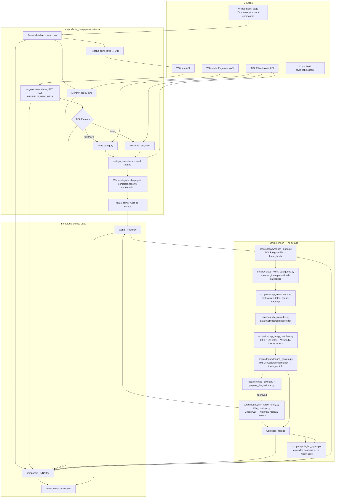
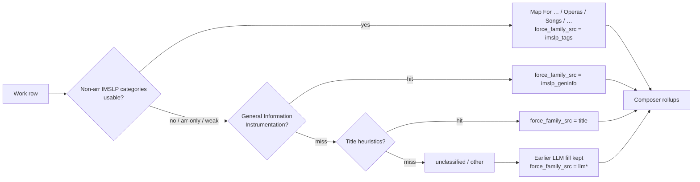

# Pipeline overview

How `eu-pd-composers` builds composer + works dumps. Heuristic PD only — not legal advice.

## End-to-end flow

Nodes under `scripts/legacy/` show how older labels were made. The pipeline no longer runs them; their labels survive through `carry_forward.py`.


```mermaid
flowchart TB
  subgraph sources [Sources]
    WIKI[Wikipedia list page<br/>20th-century classical composers]
    WD[Wikidata API]
    PV[Wikimedia Pageviews API]
    IMSLP[IMSLP MediaWiki API]
    LEDGER[Committed style_labels.jsonl]
  end

  subgraph scrape [scripts/build_dump.py — network]
    PARSE[Parse wikitable → raw rows]
    QID[Resolve enwiki title → QID]
    ENRICH[wbgetentities: dates, P27, P106,<br/>P135/P136, P800, P839]
    PAGEVIEWS[Monthly pageviews]
    MATCH{IMSLP match}
    P839[P839 category]
    HEUR[Heuristic Last, First]
    WORKS[categorymembers → work pages]
    CATS[Work categories by page id<br/>complete, follows continuation]
    FF1[force_family rules on scrape]
  end

  subgraph offline [Offline enrich — no scrape]
    ENR[scripts/legacy/enrich_dump.py<br/>IMSLP tags + title → force_family]
    GI[scripts/legacy/enrich_geninfo.py<br/>IMSLP General Information → imslp_geninfo]
    STY[legacy/remap_styles.py + prepare_llm_residual.py]
    REFRESH["scripts/refetch_work_categories.py<br/>+ remap_force.py --refresh-categories"]
    WDREMAP[scripts/remap_composers.py<br/>rank-aware dates, scope, qa_flags]
    OVR[scripts/apply_overrides.py<br/>data/overrides/composers.tsv]
    IDENT[scripts/remap_imslp_matches.py<br/>IMSLP life dates + Wikipedia link vs. match]
    STYLEREPLAY[scripts/apply_llm_styles.py<br/>grounded consensus, no model calls]
    LLM[scripts/legacy/llm_force_family.py / llm_residual.py<br/>Codex CLI — historical residual passes]
    ROLL[Composer rollups]
  end

  subgraph out [Immutable dumps data/]
    C[composers_rNNN.tsv]
    WK[works_rNNN.tsv]
    META[dump_meta_rNNN.json]
  end

  WIKI --> PARSE --> QID
  QID --> WD --> ENRICH
  PARSE --> PAGEVIEWS
  PV --> PAGEVIEWS
  ENRICH --> MATCH
  MATCH -->|has P839| P839 --> WORKS
  MATCH -->|else| HEUR --> WORKS
  IMSLP --> P839
  IMSLP --> HEUR
  IMSLP --> WORKS --> CATS --> FF1
  PARSE --> C
  ENRICH --> C
  PAGEVIEWS --> C
  MATCH --> C
  FF1 --> WK
  C --> ENR
  WK --> ENR
  ENR --> REFRESH --> WDREMAP --> OVR --> IDENT --> GI --> STY
  STY -.->|approved| LLM
  LLM --> ROLL --> C
  LLM --> WK
  GI --> ROLL
  LEDGER --> STYLEREPLAY
  ROLL --> STYLEREPLAY --> C
  C --> META
  WK --> META
```

## force_family decision order


```mermaid
flowchart LR
  A[Work row] --> B{Non-arr IMSLP categories<br/>usable?}
  B -->|yes| C[Map For … / Operas / Songs / …<br/>force_family_src = imslp_tags]
  B -->|no / arr-only / weak| GI{General Information<br/>Instrumentation?}
  GI -->|hit| GIsrc[force_family_src = imslp_geninfo]
  GI -->|miss| D{Title heuristics?}
  D -->|hit| E[force_family_src = title]
  D -->|miss| F[unclassified / other]
  F --> G[Earlier LLM fill kept<br/>force_family_src = llm*]
  C --> H[Composer rollups]
  GIsrc --> H
  E --> H
  G --> H
```

Arrangement `(arr)` category tokens never set force; opera/voice beat concerto; original orchestra beats piano reductions.

`For …` categories are parsed into parts (`For 2 violins, viola, cello` → 2 violins · viola · cello) and matched by whole words, never substrings. Conventions:

| Parts | force_family |
|---|---|
| any chorus | `choral` |
| voice(s) with any accompaniment; 1–2 unaccompanied voices | `solo_voice` |
| 3+ unaccompanied voices | `choral` |
| orchestra or `strings` (string orchestra) + soloist/instrument | `concerto` |
| orchestra / `strings` alone | `orchestral` |
| band / wind or brass ensemble | `wind_band` |
| one instrument, optionally + one keyboard (violin + piano) | `solo_instrument` |
| any guitar-family part (guitar, lute, theorbo, vihuela) | `guitar` |
| piano only (1 player / 4 hands or 2+ pianos) | `piano_solo` / `piano_ensemble` |
| organ / harpsichord, harmonium, … only | `organ` / `keyboard_other` |
| 2+ instrumentalists otherwise | `chamber` |

`For N players` and `Quartets`-style labels only decide when no explicit instrumentation category exists.

LLM history: the bulk title-only pass (r001, `force_family_src=llm`) ran gpt-6-luna at **low** reasoning; residual passes used gpt-6-luna xhigh (`llm_luna_xhigh`) and grok-4.7-high (`llm_grok`, run outside this repo). Since r009 these survive only where categories, GenInfo and title rules all fail (~1.3% of works).

## Match statuses (IMSLP)

| `imslp_match_status` | Meaning |
|---|---|
| `matched` | P839 category, or a name guess confirmed by IMSLP's life dates / Wikipedia link (`imslp_match_method` says which) |
| `unverified_heuristic` | `Last,_First` category exists; IMSLP's page has no comparable years |
| `rejected_heuristic` | Name guess whose IMSLP page is a different person (works removed) |
| `rejected_p839` | Wikidata P839 points at a different person's page (works removed) |
| `not_found` | No category resolved |
| `not_checked` | `--no-imslp` |

Identity rule (`scripts/imslp_identity.py`): compare dump birth/death years with IMSLP's `Born Year`/`Died Year`. All known pairs within ±1 → agree. A **strong** conflict (no pair agrees and a gap > 10 years) means a different person and rejects even a P839 link; a **weak** conflict keeps the match with `imslp_dates_conflict`, and promotes a name guess only if IMSLP's Wikipedia link agrees. One category belongs to at most one composer: a P839 holder wins, else the single agreeing claimant (`check_release.py` fails otherwise).

## One command: `scripts/pipeline.py`

- `pipeline.py refresh --base rPREV`: cold crawl (`build_dump.py`) plus every stage below in a staging dir; promotes **one** new revision whose meta lists the stages; re-exports the viewer; runs `check_release.py --against rPREV`. Used by the monthly workflow ([AUTOMATION.md](AUTOMATION.md)).
- `pipeline.py derive --from-dump rX --to rY`: the offline stages only (rules or overrides changed). By default it may add work-evidence and composer `llm_style_*` columns; `--preserve-schema` fails on any column change. Every output stamps `dump_date` with its revision id when the column exists; `derive` on an already-derived dump reproduces its TSVs modulo `dump_date` when the local cache matches the one that built it: uncached pages and entities keep their prior cells, but a stale cache entry overwrites them.
- `refresh` first runs `refetch_override_entities.py` (preflight: override re-key targets into the cache), then `build_dump.py`.
- Stage order: `remap_force` → `carry_forward` (earlier LLM force / GenInfo decisions, joined on composer + IMSLP page id; never over a category-derived label) → `remap_composers` → `apply_overrides` → (`refetch_composer_pages`) `remap_imslp_matches` → (`refetch_work_files`) `remap_work_evidence` → `apply_llm_styles`. The two `refetch_*` steps run on `refresh` only.
- `apply_llm_styles` reads the committed ledger after composer re-keys, selects grounded `style-v2` rows from the two pinned labellers, writes consensus/votes/period/provenance, and retires legacy `llm*` composer tags. The meta records policy, ledger SHA-256 and counts. Carry-forward retains no LLM composer styles; replay is their only source. See [ledger policy](../data/llm_ledger/README.md).
- `diff_dumps.py rPREV rNEXT --out diff.md --summary-json summary.json` writes the review report (PD flips, identity changes, works added or removed, label transitions, schema changes).
- `check_release.py --against rPREV` fails if composers change by more than 3%, works drop by more than 5%, a column disappears, or the share of works with `has_files` set falls by more than 5 points (a skipped file fetch). It also checks the `imslp_copyright_flags` and `has_files` vocabularies and warns on a new IMSLP file server.
- `EU_PD_DATA_DIR` / `EU_PD_CACHE_DIR` move the data and cache dirs (staging uses them).

## Typical commands

```bash
# Full scrape (long; heartbeats every 30s) — calendar id OK for raw scrapes
python scripts/build_dump.py --date YYYY-MM-DD

# Promote into revision series
python scripts/legacy/promote_revision.py --from-dump YYYY-MM-DD --to rNNN

# Complete IMSLP work categories for a dump (network, resumable, ~1 req/s)
python scripts/refetch_work_categories.py --dump r008

# Refresh categories from that cache, recompute force + PD labels → next revision
python scripts/remap_force.py --from-dump r008 --to r009 --refresh-categories

# Rank-aware Wikidata dates, scope, qa_flags from cached entities → next revision
python scripts/remap_composers.py --from-dump r009 --to r010

# Files linked from each work page into cache (network, resumable), then replay
# work evidence (rights categories, has_files, imslp_file_hosts) → next revision
python scripts/refetch_work_files.py --dump r015
python scripts/remap_work_evidence.py --from-dump r015 --to r016

# Replay committed grounded style consensus (offline; no model calls)
python scripts/apply_llm_styles.py --from-dump r014 --to r015

# Hand-reviewed overrides (data/overrides/composers.tsv) → next revision
python scripts/apply_overrides.py --from-dump r010 --to r011

# IMSLP composer pages into cache (network), then verify matches → next revision
python scripts/refetch_composer_pages.py --dump r011
python scripts/remap_imslp_matches.py --from-dump r011 --to r012

# Legacy one-off passes (scripts/legacy/; not run by the pipeline)
python scripts/legacy/enrich_geninfo.py --from-dump rNNN --to rNNN+1 --limit 200 --remap-styles
python scripts/legacy/prepare_llm_residual.py --dump rNNN
python scripts/legacy/llm_residual.py --from-dump rNNN --to rNNN+1 --reasoning xhigh
```

Caches: `data/cache/` (gitignored). Complete work categories under `imslp_page_cats/`, linked files under `imslp_page_files/` (both by page id); composer pages under `imslp_cat_page/` (by page id; the old title-keyed `imslp_work_cats/` is truncated — do not use). GenInfo under `imslp_geninfo/`; LLM batches under hashed cache keys. Older dumps: git history only.

## Filter viewer

```bash
python scripts/export_viewer_json.py --dump r016
python scripts/check_release.py --dump r016 --viewer-data viewer/data
python -m http.server 8080 --directory viewer
```

Static UI under `viewer/`; GitHub Pages workflow publishes that folder from **`main`**.
