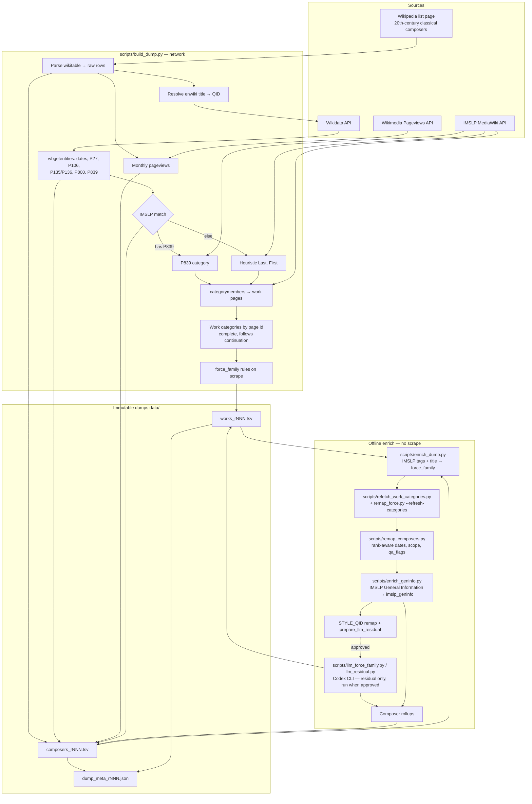
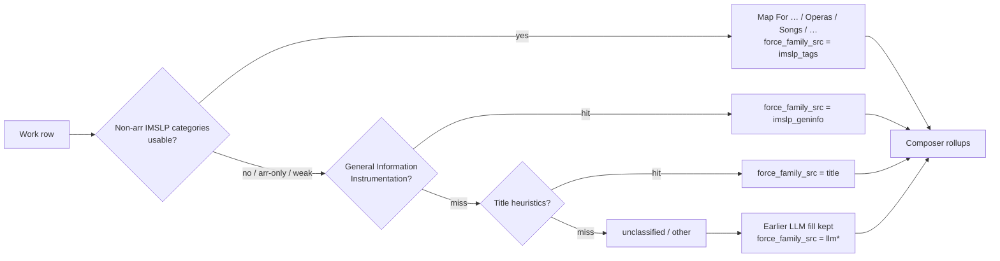

# Pipeline overview

How `eu-pd-composers` builds composer + works dumps. Heuristic PD only — not legal advice.

## End-to-end flow


```mermaid
flowchart TB
  subgraph sources [Sources]
    WIKI[Wikipedia list page<br/>20th-century classical composers]
    WD[Wikidata API]
    PV[Wikimedia Pageviews API]
    IMSLP[IMSLP MediaWiki API]
  end

  subgraph scrape [scripts/build_dump.py — network]
    PARSE[Parse wikitable → raw rows]
    QID[Resolve enwiki title → QID]
    ENRICH[wbgetentities: dates, P27, P106,<br/>P135/P136, P800, P839]
    PAGEVIEWS[Monthly pageviews]
    MATCH{IMSLP match}
    P839[P839 category]
    HEUR[Heuristic Last, First]
    WORKS[categorymembers → work pages]
    CATS[Work categories by page id<br/>complete, follows continuation]
    FF1[force_family rules on scrape]
  end

  subgraph offline [Offline enrich — no scrape]
    ENR[scripts/enrich_dump.py<br/>IMSLP tags + title → force_family]
    GI[scripts/enrich_geninfo.py<br/>IMSLP General Information → imslp_geninfo]
    STY[STYLE_QID remap + prepare_llm_residual]
    REFRESH["scripts/refetch_work_categories.py<br/>+ remap_force.py --refresh-categories"]
    WDREMAP[scripts/remap_composers.py<br/>rank-aware dates, scope, qa_flags]
    LLM[scripts/llm_force_family.py / llm_residual.py<br/>Codex CLI — residual only, run when approved]
    ROLL[Composer rollups]
  end

  subgraph out [Immutable dumps data/]
    C[composers_rNNN.tsv]
    WK[works_rNNN.tsv]
    META[dump_meta_rNNN.json]
  end

  WIKI --> PARSE --> QID
  QID --> WD --> ENRICH
  PARSE --> PAGEVIEWS
  PV --> PAGEVIEWS
  ENRICH --> MATCH
  MATCH -->|has P839| P839 --> WORKS
  MATCH -->|else| HEUR --> WORKS
  IMSLP --> P839
  IMSLP --> HEUR
  IMSLP --> WORKS --> CATS --> FF1
  PARSE --> C
  ENRICH --> C
  PAGEVIEWS --> C
  MATCH --> C
  FF1 --> WK
  C --> ENR
  WK --> ENR
  ENR --> REFRESH --> WDREMAP --> GI --> STY
  STY -.->|approved| LLM
  LLM --> ROLL --> C
  LLM --> WK
  GI --> ROLL
  C --> META
  WK --> META
```

## force_family decision order


```mermaid
flowchart LR
  A[Work row] --> B{Non-arr IMSLP categories<br/>usable?}
  B -->|yes| C[Map For … / Operas / Songs / …<br/>force_family_src = imslp_tags]
  B -->|no / arr-only / weak| GI{General Information<br/>Instrumentation?}
  GI -->|hit| GIsrc[force_family_src = imslp_geninfo]
  GI -->|miss| D{Title heuristics?}
  D -->|hit| E[force_family_src = title]
  D -->|miss| F[unclassified / other]
  F --> G[Earlier LLM fill kept<br/>force_family_src = llm*]
  C --> H[Composer rollups]
  GIsrc --> H
  E --> H
  G --> H
```

Arrangement `(arr)` category tokens never set force; opera/voice beat concerto; original orchestra beats piano reductions.

`For …` categories are parsed into parts (`For 2 violins, viola, cello` → 2 violins · viola · cello) and matched by whole words, never substrings. Conventions:

| Parts | force_family |
|---|---|
| any chorus | `choral` |
| voice(s) with any accompaniment; 1–2 unaccompanied voices | `solo_voice` |
| 3+ unaccompanied voices | `choral` |
| orchestra or `strings` (string orchestra) + soloist/instrument | `concerto` |
| orchestra / `strings` alone | `orchestral` |
| band / wind or brass ensemble | `wind_band` |
| one instrument, optionally + one keyboard (violin + piano) | `solo_instrument` |
| any guitar-family part (guitar, lute, theorbo, vihuela) | `guitar` |
| piano only (1 player / 4 hands or 2+ pianos) | `piano_solo` / `piano_ensemble` |
| organ / harpsichord, harmonium, … only | `organ` / `keyboard_other` |
| 2+ instrumentalists otherwise | `chamber` |

`For N players` and `Quartets`-style labels only decide when no explicit instrumentation category exists.

LLM history: the bulk title-only pass (r001, `force_family_src=llm`) ran gpt-6-luna at **low** reasoning; residual passes used gpt-6-luna xhigh (`llm_luna_xhigh`) and grok-4.7-high (`llm_grok`, run outside this repo). Since r009 these survive only where categories, GenInfo and title rules all fail (~1.3% of works).

## Match statuses (IMSLP)

| `imslp_match_status` | Meaning |
|---|---|
| `matched` | Wikidata P839 category verified on IMSLP |
| `unverified_heuristic` | `Last,_First` category exists (collision risk) |
| `not_found` | No category resolved |
| `not_checked` | `--no-imslp` |

## Typical commands

```bash
# Full scrape (long; heartbeats every 30s) — calendar id OK for raw scrapes
python scripts/build_dump.py --date YYYY-MM-DD

# Promote into revision series
python scripts/promote_revision.py --from-dump YYYY-MM-DD --to rNNN

# Complete IMSLP work categories for a dump (network, resumable, ~1 req/s)
python scripts/refetch_work_categories.py --dump r008

# Refresh categories from that cache, recompute force + PD labels → next revision
python scripts/remap_force.py --from-dump r008 --to r009 --refresh-categories

# Rank-aware Wikidata dates, scope, qa_flags from cached entities → next revision
python scripts/remap_composers.py --from-dump r009 --to r010

# GenInfo pilot + Wikidata style remap → next revision
python scripts/enrich_geninfo.py --from-dump rNNN --to rNNN+1 --limit 200 --remap-styles

# Prepare residual LLM queue (does not call Codex)
python scripts/prepare_llm_residual.py --dump rNNN

# LLM fill when approved (Codex + gpt-6-luna, reasoning xhigh)
python scripts/llm_residual.py --from-dump rNNN --to rNNN+1 --reasoning xhigh
```

Caches: `data/cache/` (gitignored). Complete work categories under `imslp_page_cats/` (by page id; the old title-keyed `imslp_work_cats/` is truncated — do not use). GenInfo under `imslp_geninfo/`; LLM batches under hashed cache keys. Older dumps: git history only.

## Filter viewer

```bash
python scripts/export_viewer_json.py --dump r010
python scripts/check_release.py --dump r010 --viewer-data viewer/data
python -m http.server 8080 --directory viewer
```

Static UI under `viewer/`; GitHub Pages workflow publishes that folder from **`main`**.
